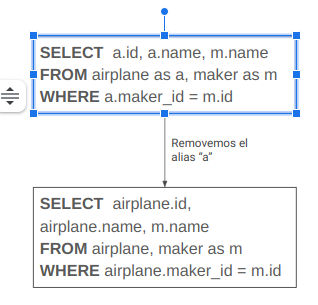

REMOVE ALIAS REFACTORING

Este proyecto académico para la asignatura de Orientación a Objetos 2 en la Universidad de La Plata se basa en realizar un Refactoring en una consulta de SQLite utilizando los patrones de diseño Visitor y Template Method. Es Refactoring se llevará a cabo empleando ANTLR4 (Another Tool for Language Recognition ) en conjunto con el lenguaje de programación Java. Además, se emplearon tanto Hamcrest como JUnit para llevar a cabo pruebas unitarias en el desarrollo del proyecto en Java. 

VERSIONES   

openjdk => 17.0.9
antlr => 4.13.1
junit => 4.13.2
hamcrest-all => 1.3

URL que explica instalación Junit y utilización por terminal:
https://hikmetcakir.medium.com/how-to-run-test-classes-in-command-line-2322da70195f

Variables de entorno
Para ejercutar el proyecto a través de línea de comandos, debemos agregar algunas variables para que nuestro sistema interprete y compile el código. Por lo tanto es necesario que la variable CLASSPATH posea:
- La dirección donde se encuentra antlr4 
- La dirección donde se encuentra hamcrest
- La dirección donde se encuentra junit
- La carpeta donde están las clases generadas por antlr4

Linux/MAC OS
Dentro de nuestro archivo ~/.bashrc deberan tener estas variables:

-export CLASSPATH="/usr/local/lib/antlr-4.13.1-complete.jar:/usr/local/lib/junit>
-alias antlr4='java -Xmx500M -cp "/usr/local/lib/antlr-4.13.1-complete.jar:$CLAS>
-alias grun='java -Xmx500M -cp "/usr/local/lib/antlr-4.13.1-complete.jar:$CLASSP>
-export PATH=~/.npm-global/bin:$PATH
-export JAVA_HOME=/usr/lib/jvm/java-17-openjdk-amd64
-export PATH=$JAVA_HOME/bin:$PATH

WINDOWS

-Crear una carpeta con algún nombre significativo (ej: JavaLib) donde colocaremos varios archivos para que ANTLR funcione.

-Crear los siguientes 3 archivos en la carpeta creada (ej: C:\JavaLib):
antlr4.bat donde debe contener  java org.antlr.v4.Tool %*
class.bat donde debe contener SET CLASSPATH=.;%CLASSPATH%
grun.bat donde debe contener java org.antlr.v4.gui.TestRig %*

Buscar en la barra de búsqueda de Windows “Editar variables de entorno” y seleccionar “Variables de entorno”. 

En la sección de “Variables del sistema“ agregar una nueva variable con nombre “CLASSPATH” y con valor que sea el path donde se encuentre el jar de ANTLR descargado.
-“C:\JavaLib\antlr-4.13.0-complete.jar”.

En la sección de “Variables de usuario”, seleccionar la variable “Path” y editarla. Hay que agregar dos valores: 
1- La referencia a la variable de sistema => %CLASSPATH% 
2- La dirección de la carpeta que creamos anteriormente => C:\JavaLib

Para comprobar el funcionamiento, abrir el CMD y ejecutar el comando antlr4. 

Compilacion

Para compilar las clases de ANTLR4 que necesitamos para el proyecto debemos ejecutar el comando:
-javac .\sqlitegrammar\*.java .\*.java

Para compilar nuestro proyecto nos tendremos que ubicar en la raiz de nuestro proyecto y ejecutar este comando:
-javac *.java;

Luego, para correr nuestro proyecto debemos ejecutar los siguiente comandos:
-java org.junit.runner.JUnitCore TusTestCase

Aclaracion: se puede compilar y correr los Test de nuestro proyecto utilizando este comando:
-javac *.java; java org.junit.runner.JUnitCore TusTestCase

Objetivo del proyecto:
Dada una consulta SQL y un alias a eliminar, busca dicho alias en la consulta, lo elimina y reemplaza las referencias al mismo por el nombre de la tabla o columna correspondiente.

PreCondiciones a tener en cuenta:

- La consulta debe ser válida (Parsea)
- El alias a remover debe existir en la consulta y está asociado a una tabla o columna.

PostCondiciones a tener en cuenta:

- La consulta es válida (Parsea)
- El alias a remover ya no se encuentra en la consulta

Implementación: 

AliasCheckerVisitor
    Recorre el árbol generado por Antlr4 buscando el alias a remover, si lo encuentra, pone en verdadero la variable booleana “aliasEncontrado”(por defecto es falsa) y guarda la referencia a la tabla/columna en “aliasReference”.
RemoveAliasVisitor
    Recorre el árbol generado por Antlr4 donde por cada nodo visitado va armando la query transformada a partir de la variable "querySeparate" la cual es un StringBuilder. Ademas en los nodos donde se puede declarar un alias este es eliminado junto con la palabra clave  "as"(puede no declarar el alias con "as" e igualmente es eliminada la parte donde se declara el alias). Por consiguiente por cada referencia del alias que haya en la consulta esta es reemplazada por el nombre de tabla o columna que esta guardado en “aliasReference”
RemoveAliasRefactoring
    Subclase de Refactoring, define la lógica para chequear post y pre condiciones, hacer las transformaciones y settear el alias a remover.Utilizando el patron Tempate Method.
RemoveAliasRefactoringTest
    Colección de test para comprobar que dadas las PreCondiciones y PostCondiciones, realiza correctamente las transformaciones.

Concluciones: 
    Se chequea que como PreCondición se parsee la consulta y el alias a remover exista, y que como PostCondición parsee y el alias a remover no exista, esto lo hacemos mediante el AliasCheckerVisitor.
    Es un refactoring porque la consulta antes y después de la transformación tiene el mismo comportamiento (solo cambia la sintaxis).

Aclaracion: Las consultas se deben realizar sin ponner ';' al final de la consulta.

